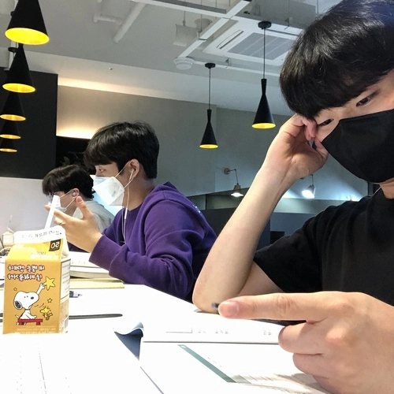

# SeoulAwake

24-hour cafes in Seoul, the city that never sleeps

  

## Description

**SeoulAwake** is a 24-hour cafe guide service that connects night of Seoul which reminds you of the Han River. Even after your tired day, Seoul is still shining for you. We will let you to find a place where you can take a breath in Seoul at dawn. **SeoulAwake** can help you to refresh in an open cafe, study or work all night long.

## Authors

**Frontend**

- Tommy ([@tooooo1](https://github.com/tooooo1))

**Backend**

- John ([@Hejow](https://github.com/Hejow))

## License

MIT © Tommy John. See [LICENSE](./LICENSE) for details.
